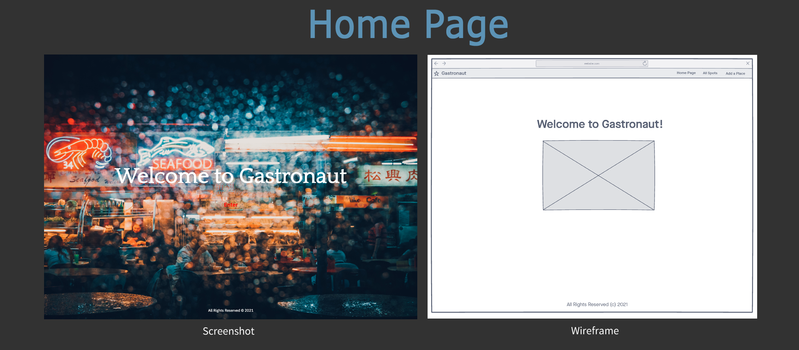
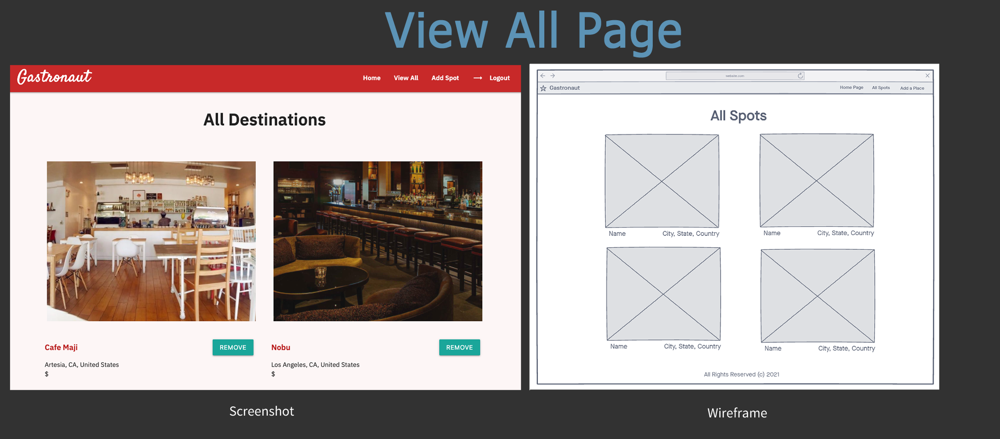
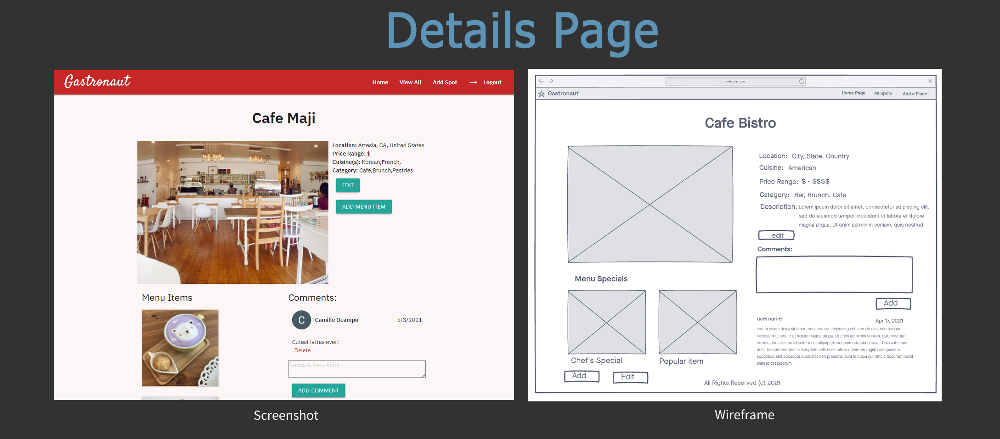
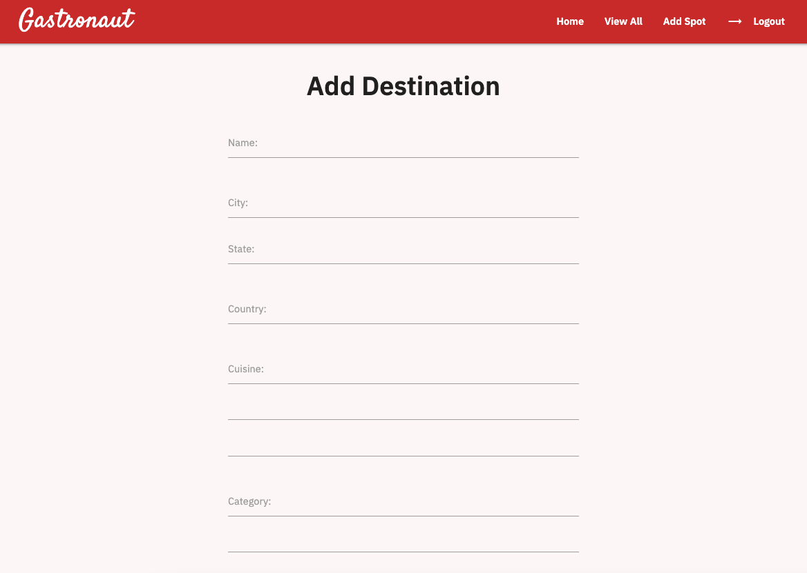
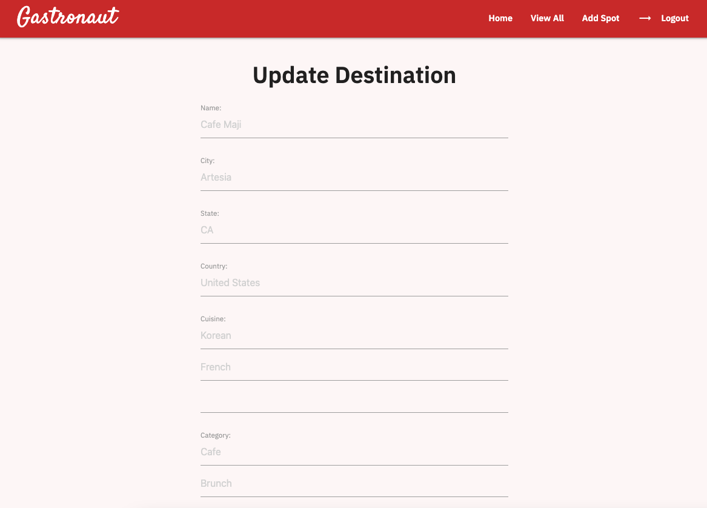
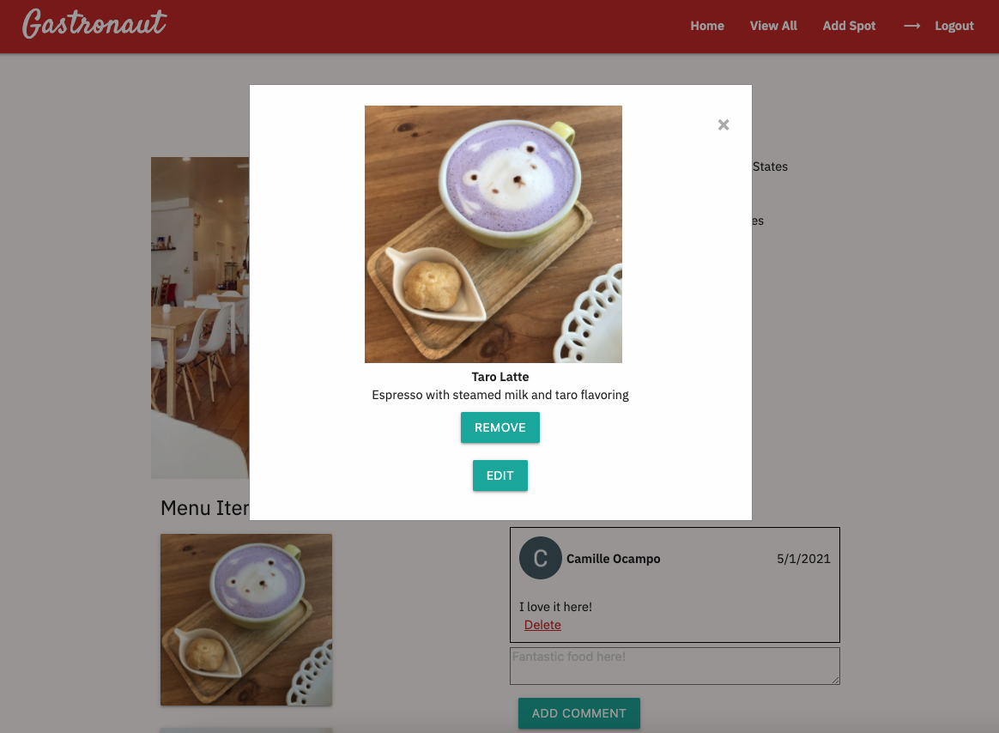
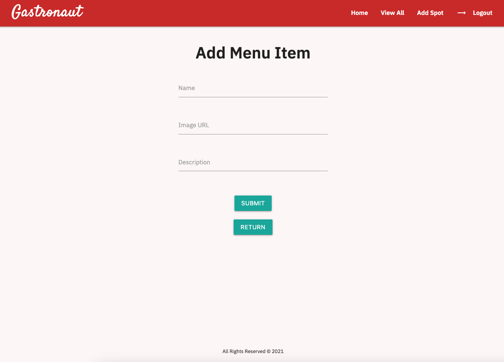
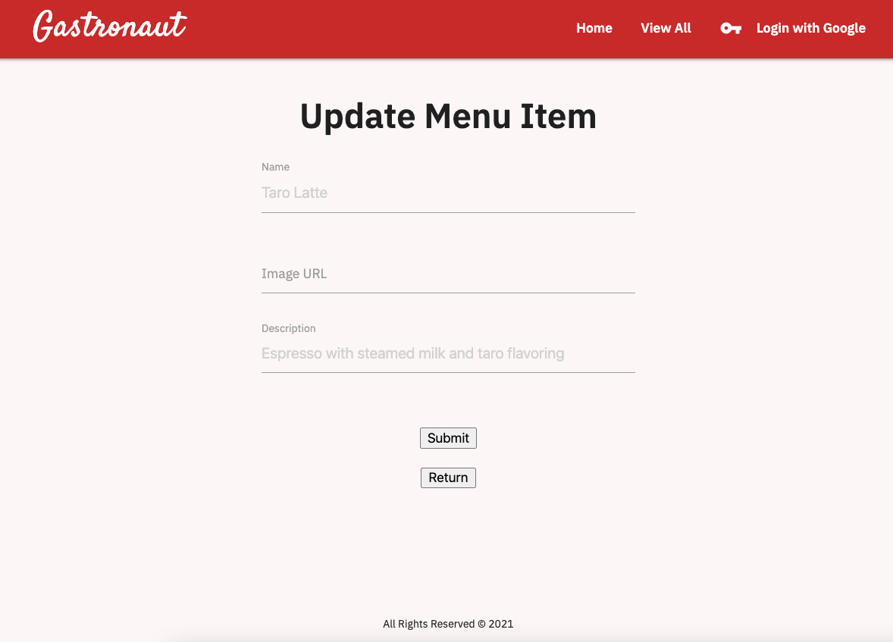
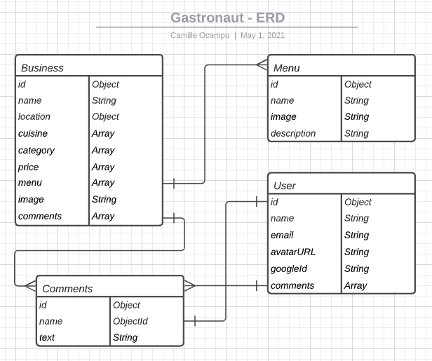

# Project 2 - Gastronaut
A "foodie wishlist" CRUD web application that allows you to add destinations of places you want to eat, and add specific menu items from that destination that are of interest to you. Also allows users to add comments about various food destinations

--------------------

## Getting Started
Click [here](https://gastronaut-app.herokuapp.com/) to see the app on Heroku!

--------------------

## Technologies Used
- HTML
- CSS
- JavaScript/jQuery
- Mongoose
- MongoDB
- Express.js
- Node.js
- Passport JS
- EJS (Embedded Java Templates)
- Google Fonts
- Materialize CSS
- OAuth 2.0 with Google

--------------------

## Screenshots and Wireframes
Home Page

Index page upon entry into site

Details page upon clicking on any of the destinations.

Clicking the "Add Spot" link on the nav bar brings you to this form.

From a destination's page, you can click "Edit" and be brought to this page to edit the details of that destination.

You can click on the image under "Menu" if it is available for that destination to get a pop-up with the details of that menu item.

Clicking the "Add Menu Item" button right below the destination's details will bring you to this form.

On the popup of the menu item, there is a "Edit" button. Clicking the button will bring you to this page to edit the details of that menu item.

--------------------

## ERDs

The main data model of this web application is the "Business" model, also named "Destination".

Secondary is the "Menu" model, which "Business" has a One-to-Many relationship with.

The "Comments" model is an embedded Schema within "Business". It is also related to "User" model, where each "Comment" subdoc has one "User", but each "User" can be related to many different "Comment" docs.

--------------------

## Next Steps
- Adding responsive design for tablet screens and mobile devices
- Adding search query function to index
- Adding a feature to allow users to upload images directly from their computer