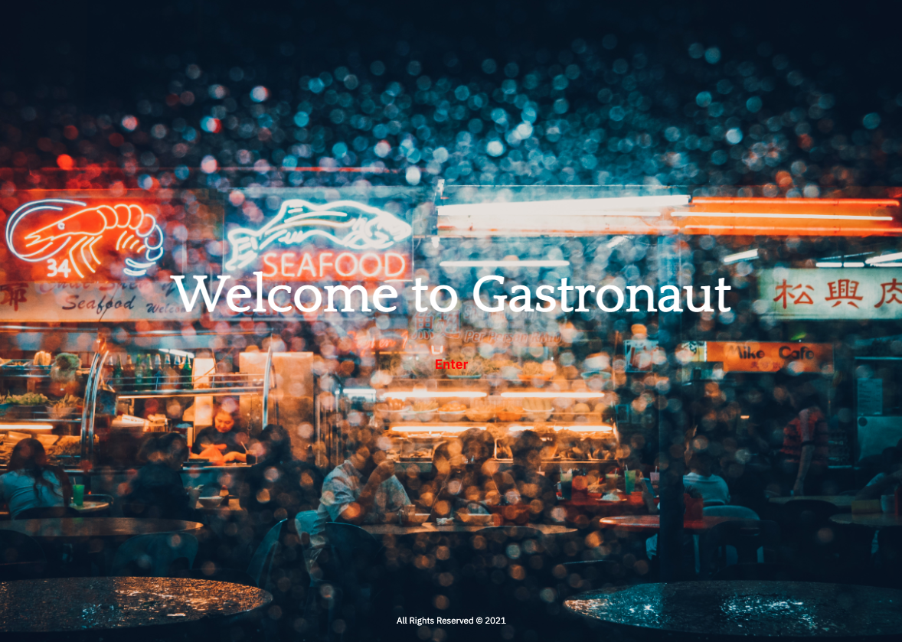
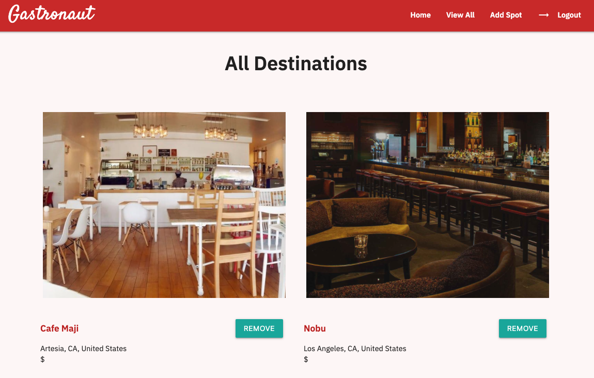
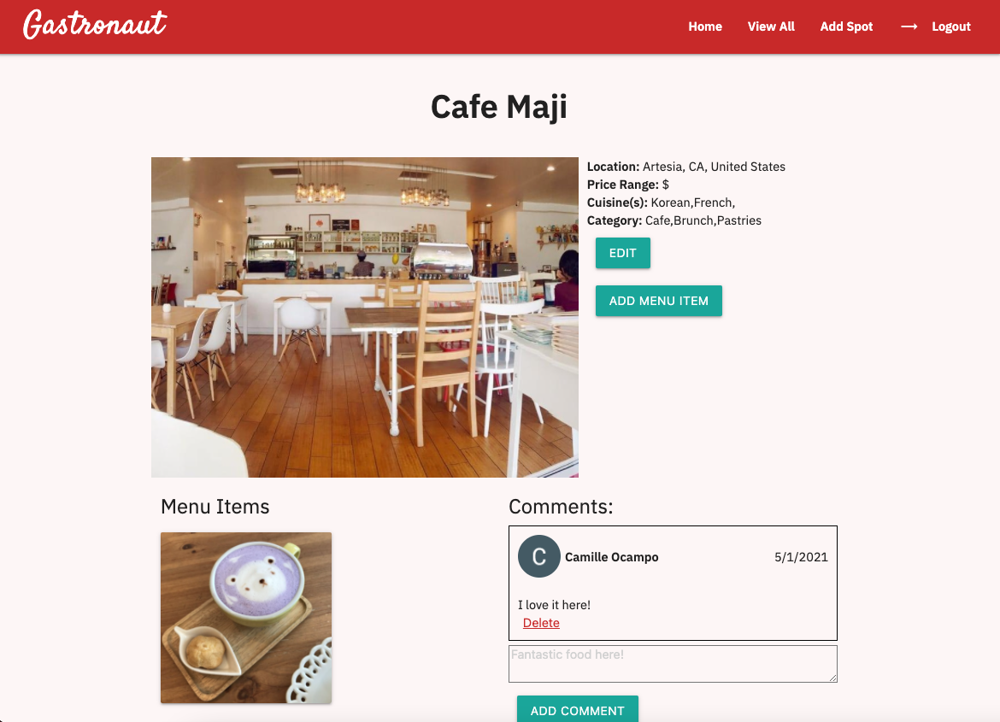
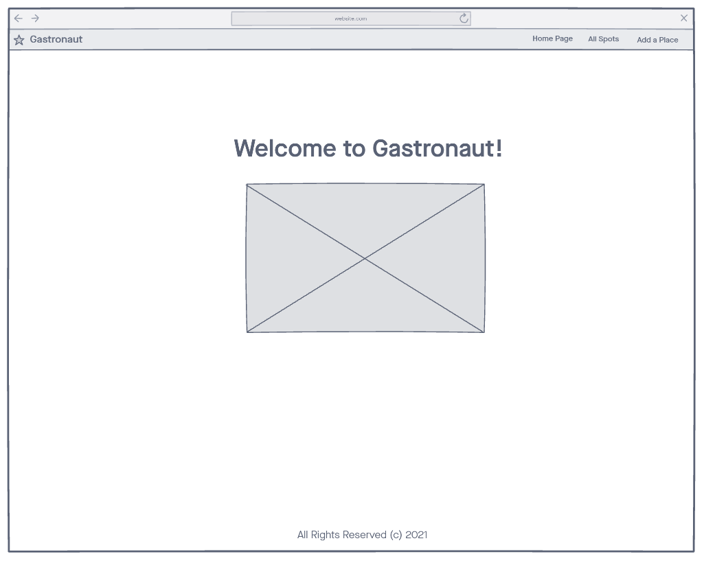
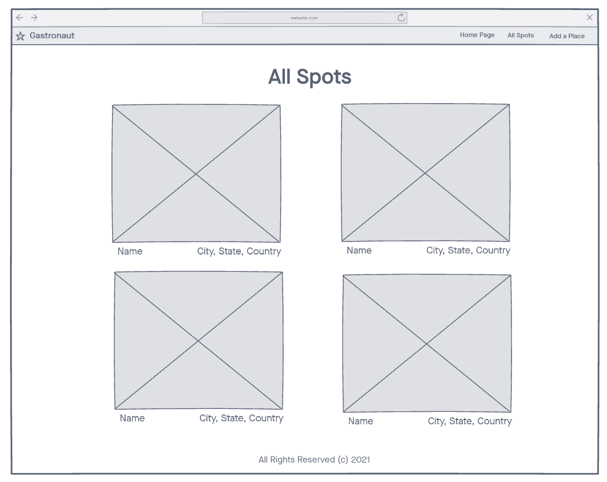
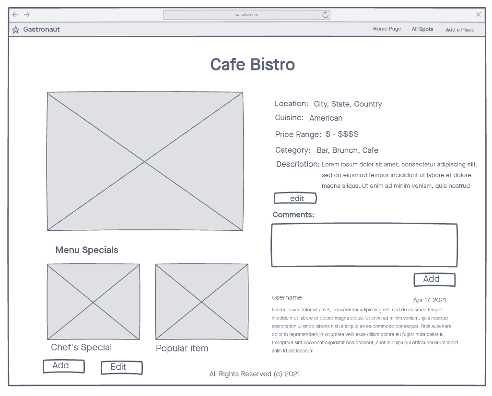

# Project 2 - Gastronaut
A "foodie wishlist" CRUD web application that allows you to add destinations of places you want to eat, and add specific menu items from that destination that are of interest to you. Also allows users to add comments about various food destinations

## Getting Started
Click [here](https://gastronaut-app.herokuapp.com/) to see the app on Heroku!

## Technologies Used
- HTML
- CSS
- JavaScript/jQuery
- Mongoose
- MongoDB
- Express.js
- Node.js
- Passport JS
- EJS (Embedded Java Templates)
- Google Fonts
- Materialize CSS
- OAuth 2.0 with Google

## Screenshot(s)

## Wireframes

## ERDs

## Next Steps
- Adding responsive design for tablet screens and mobile devices
- Adding search query function to index
- Adding a feature to allow users to upload images directly from their computer